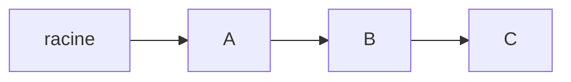
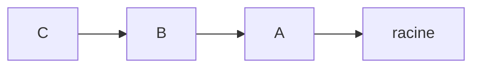
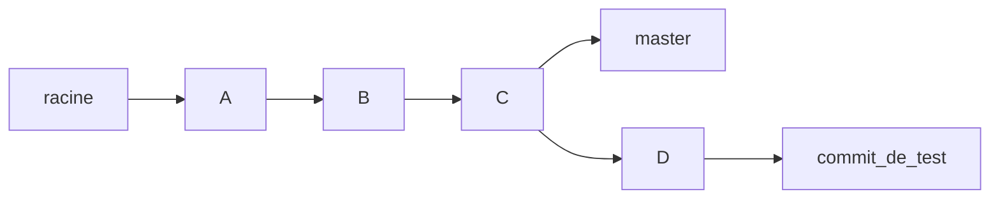
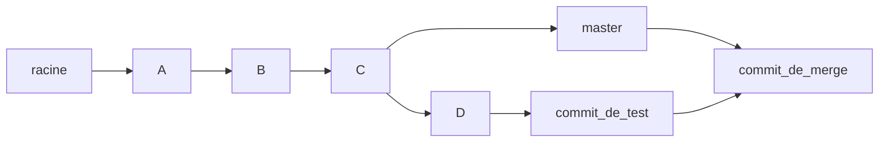

# Git
Git est un "**V**ersion **C**ontrol **S**ystem" (VCS). Sa fonction
est de permettre de suivre *l'évolution* de l'entièreté du code source d'un projet,
au cours du temps (certains projets sont suivis depuis [plusieurs décennies](https://github.com/torvalds/linux)).  
D'autres VCS ont existé et continuent d'être créés (SVN, Mercurial, Bazaar, ...) mais
git est le plus utilisé de nos jours.

Git fonctionne par "**dépôt**".  
Un dépot (ou **repo**sitory en anglais), c'est un ensemble de fichiers et la trace
des modifications qui y ont été apportées par divers auteurs, au cours du temps.

Une particularité de Git est d'être **décentralisé**. Cela veut dire que, pour un
même dépôt copié par plusieurs personnes, aucune des copies n'est "la copie principale",
toutes les copies sont aussi legitimes les unes que les autres, et c'est à l'équipe
de développeurs de s'organiser pour savoir quelle version considérer comme principale.  
En général, on va mettre la version qu'ont veut utiliser comme principale sur un serveur,
et y accéder au travers de ce qu'on appelle une "forge logicielle", comme GitHub ou Gitlab.

Git possède beaucoup d'outils pour récupérer des modifications faites sur une autre copie
d'un dépôt, en vue de facilement collaborer à plusieurs. Cela permet à plusieurs personnes
de se baser sur des versions plus ou moins vieilles d'un repo, d'effecuter des changements dessus,
et lorsqu'ils ont fini, de faire converger toutes les modifications faites.

## Gestion des changements locaux
Git possède **3** "zones" dans lesquelles il manipule des informations:
1. Le "**working tree**", qui correspond aux fichiers qui sont sur ton disque, et dans lesquels
tu écris ton code.
2. La "**staging area**" (ou index). Lorsqu'un fichier du working tree est modifié, et que tu veux signifier
que ces modifications sont à garder, tu vas les mettre dans la *staging area*. C'est ce à quoi
sert la command "**git add**". La commande va venir dire "Je veux que les modifications du 
working tree pour les fichiers en question, soient mises and la staging area"
3. Le "**repository**" (ou dépôt). C'est ici que sont réellement enregistrées les informations.
C'est le contenu de cet zone qui est échangé entre les copies d'un repo.
La commande "**git commit**" vient prendre les informations de la staging area, leur attribuer
un auteur et un message, et les enregistrer définitivement dans le repository

## Détails d'implémentation
Un commit est défini par son "**sha-1**". on considère que c'est son identifiant.
Le sha-1 est calculé automatiquement en fonction du contenu d'un commit et du sha-1 de son
parent.
Il est également possible de donner des "surnoms" à un sha-1 comme, "**master**" ou "v1.0".
Oui, une branche sur git n'est en fait qu'une référence à un commit en particulier.
Comme le sha-1 d'un commit dépend uniquement de lui-même et de son parent, cela implique
que l'on peut remonter au commit précédent à partir d'un commit (et donc de trouver tous
ses ancêtres), mais pas l'inverse !
Par exmple:

Dans l'ordre, on a le commit racine fait en premier, et ainsi de suite jusqu'à "C" en dernier.  
Une erreur courante est de croire que les flèches représentent l'ordre dans lequel on peut
naviguer dans ce graphe. Non. Ces flèches représentent uniquement l'ordre chronologique.
Le graphe de navigation est en fait celui-ci:

Racine ne connaît **aucun** de ses descendants, alors que C peut, de proche en proche, remonter jusqu'à racine.

## Branches / historiques parallèles
Une branche *permet* de suivre l'une suite de modifications, du bout de la branche jusqu'au premier commit fait
sur le repo. Plusieurs branches peuvent coexister, par exemple:

Cela peut se produire si, à un instant T, la version la plus à jour du repo (mettons, sur Github) est à C.
C'est le dernier commit sur la branche master.  
Michel veut implémenter une fonctionnalité, et commence à developper. Il fait d'abord le commit D, puis
le commit "commit_de_test" tous ses commits sont en local, il n'a pas "git push".  
En même temps, Jean est également parti du commit C, et a ajouté quelque chose, puis fait un commit.
Ensuite, Jean a, lui, **fait** son "git push". La branche "master" obtient alors un nouveau commit.  
Résultat: l'historique a divergé. Que Michel ait explicitement créé une branche ou non, à n'importe quel moment
durant son développement ou avant, le résultat est exactement le même. Ceci dit, Michel aurait probablement
dû créer une branche dédiée, car cela aurait rendu les manipulations suivantes plus simples, notamment le "**merge**"

## Merge
Un merge consiste à prendre plusieurs branches, et à les réunir en un commit. Dans notre exemple précédent, on observait donc ça:

